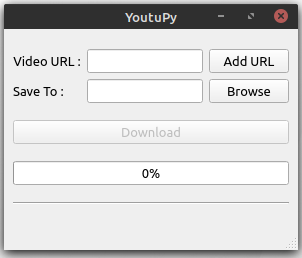
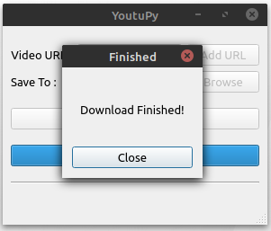

# YoutuPy – Youtube Mp3 Downloader

YoutuPy application is a simple application that allows you to download your youtube video as mp3.

[![discord server](https://img.shields.io/discord/701200443690451045?color=blue&logo=data%3Aimage%2Fsvg%2Bxml%3Bbase64%2CPHN2ZyBpZD0iTGF5ZXJfMSIgeG1sbnM9Imh0dHA6Ly93d3cudzMub3JnLzIwMDAvc3ZnIiB2aWV3Qm94PSIwIDAgMjQ1IDI0MCI%2BPHN0eWxlPi5zdDB7ZmlsbDojNzI4OURBO308L3N0eWxlPjxwYXRoIGNsYXNzPSJzdDAiIGQ9Ik0xMDQuNCAxMDMuOWMtNS43IDAtMTAuMiA1LTEwLjIgMTEuMXM0LjYgMTEuMSAxMC4yIDExLjFjNS43IDAgMTAuMi01IDEwLjItMTEuMS4xLTYuMS00LjUtMTEuMS0xMC4yLTExLjF6TTE0MC45IDEwMy45Yy01LjcgMC0xMC4yIDUtMTAuMiAxMS4xczQuNiAxMS4xIDEwLjIgMTEuMWM1LjcgMCAxMC4yLTUgMTAuMi0xMS4xcy00LjUtMTEuMS0xMC4yLTExLjF6Ii8%2BPHBhdGggY2xhc3M9InN0MCIgZD0iTTE4OS41IDIwaC0xMzRDNDQuMiAyMCAzNSAyOS4yIDM1IDQwLjZ2MTM1LjJjMCAxMS40IDkuMiAyMC42IDIwLjUgMjAuNmgxMTMuNGwtNS4zLTE4LjUgMTIuOCAxMS45IDEyLjEgMTEuMiAyMS41IDE5VjQwLjZjMC0xMS40LTkuMi0yMC42LTIwLjUtMjAuNnptLTM4LjYgMTMwLjZzLTMuNi00LjMtNi42LTguMWMxMy4xLTMuNyAxOC4xLTExLjkgMTguMS0xMS45LTQuMSAyLjctOCA0LjYtMTEuNSA1LjktNSAyLjEtOS44IDMuNS0xNC41IDQuMy05LjYgMS44LTE4LjQgMS4zLTI1LjktLjEtNS43LTEuMS0xMC42LTIuNy0xNC43LTQuMy0yLjMtLjktNC44LTItNy4zLTMuNC0uMy0uMi0uNi0uMy0uOS0uNS0uMi0uMS0uMy0uMi0uNC0uMy0xLjgtMS0yLjgtMS43LTIuOC0xLjdzNC44IDggMTcuNSAxMS44Yy0zIDMuOC02LjcgOC4zLTYuNyA4LjMtMjIuMS0uNy0zMC41LTE1LjItMzAuNS0xNS4yIDAtMzIuMiAxNC40LTU4LjMgMTQuNC01OC4zIDE0LjQtMTAuOCAyOC4xLTEwLjUgMjguMS0xMC41bDEgMS4yYy0xOCA1LjItMjYuMyAxMy4xLTI2LjMgMTMuMXMyLjItMS4yIDUuOS0yLjljMTAuNy00LjcgMTkuMi02IDIyLjctNi4zLjYtLjEgMS4xLS4yIDEuNy0uMiA2LjEtLjggMTMtMSAyMC4yLS4yIDkuNSAxLjEgMTkuNyAzLjkgMzAuMSA5LjYgMCAwLTcuOS03LjUtMjQuOS0xMi43bDEuNC0xLjZzMTMuNy0uMyAyOC4xIDEwLjVjMCAwIDE0LjQgMjYuMSAxNC40IDU4LjMgMCAwLTguNSAxNC41LTMwLjYgMTUuMnoiLz48L3N2Zz4%3D&style=for-the-badge)](https://discord.gg/cuHwWeg)

The source code is published under GPLv3, the license is available [here][license].

## Download

- **[Latest release](https://github.com/mthnglac/YoutuPy/releases/latest)**

Note: This application requires FFmpeg multimedia framework, which you can [download here](https://ffmpeg.org/download.html).

## Features

- Supports single videos, playlists, channels, and search queries
- Output format: mp3
- Automatic media tagging for audio downloads

## for Developers (windowsOS)

- You need to path your "api-ms-win-crt-multibyte-l1-1-0.dll" file. [more info](https://www.intenseclick.com/api-ms-win-crt-runtime-l1-1-0-dll-is-missing-error/).
- If you get "makensis.exe" error, install NSIS and path your its source folder. [more info](https://nsis.sourceforge.io/Download).

Support
=======

If you need assistance or you have a question, you can ask for help on discord or join us on twitter:

* **[Discord](https://discord.gg/cuHwWeg)** (English, Turkish)
* **[Twitter](https://twitter.com/YoutuPyApp)**

## Supported systems

* Windows 10

## Third-party

* PySide2 5.14.2 ([LGPL](https://doc.qt.io/qt-5/lgpl.html))
* youtube_dl 2020.3.24 ([public domain](https://github.com/ytdl-org/youtube-dl/blob/master/LICENSE))
* requests 2.23.0 ([Apache License 2.0](https://github.com/psf/requests/blob/master/LICENSE))
* fbs 0.8.6 ([GPL](https://github.com/mherrmann/fbs/blob/master/LICENSE))

[license]: https://github.com/mthnglac/YoutuPy/blob/master/LICENSE
